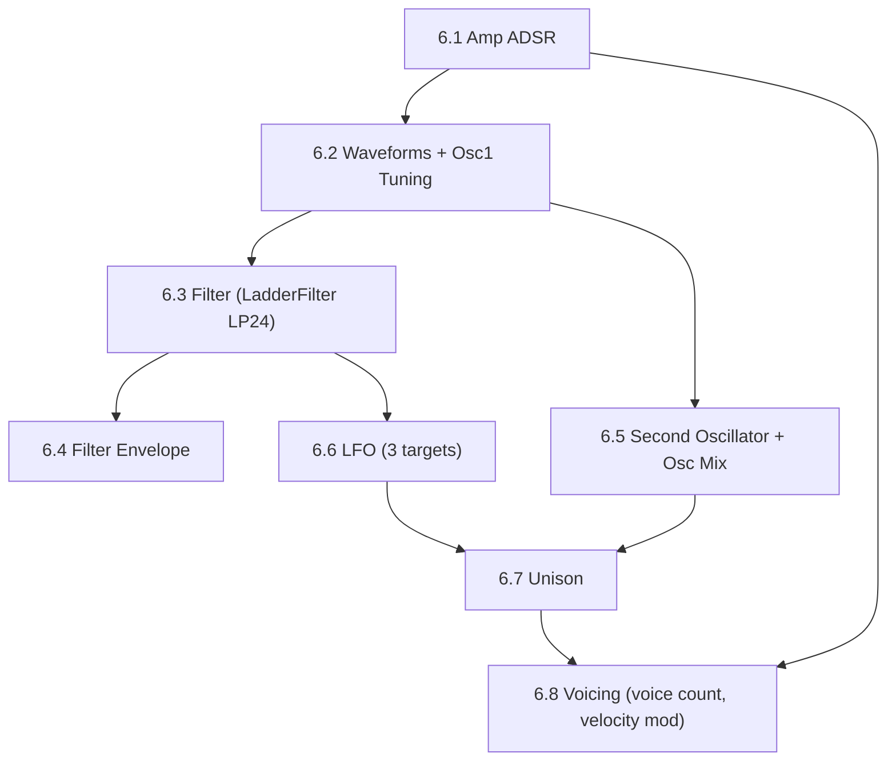

# Phase 6 — DSP Roadmap

The core synthesis engine. Transforms Solace Synth from a sine-wave demo into a real polyphonic subtractive synth.

---

## Architecture Overview

All DSP lives in `Source/DSP/`. Each module is a header-only or `.h/.cpp` pair. Modules are composed **per-voice** inside `SolaceVoice::renderNextBlock()`, while global effects (if any later) go in `PluginProcessor::processBlock()` after `synth.renderNextBlock()`.

```
Signal flow (per voice):
  MIDI note-on → startNote(velocity)
       ↓
  Oscillator 1 ──┐
                  ├── Level Mix ── Filter ── Amp Envelope ── output
  Oscillator 2 ──┘         ↑          ↑           ↑
                         LFO mod  Filter Env    Velocity
       ↑
  LFO → Pitch (if target = Osc1/Osc2 Pitch)
```

### APVTS Parameter Naming Convention

All new parameters follow the pattern: `{section}{ParamName}` with version `1`.

Examples: `ampAttack`, `ampDecay`, `osc1Waveform`, `filterCutoff`, `lfoRate`.

Parameters MUST be registered in `createParameterLayout()` **before** any APVTS snapshot can reference them.

---

## Sub-Phase 6.1 — Amplifier ADSR Envelope

**Why first:** Without an envelope, every note is an organ-like gate (on/off). ADSR is the single biggest improvement to playability and proves the per-voice ADSR pipeline.

### Files

| Action | File | What |
|--------|------|------|
| NEW | `Source/DSP/SolaceADSR.h` | Thin wrapper around `juce::ADSR`. Holds `juce::ADSR::Parameters`. Provides `trigger()`, `release()`, `getNextSample()`, `isActive()`, `setSampleRate()`. Keeps the voice code clean. |
| MODIFY | `Source/DSP/SolaceVoice.h` | Add `SolaceADSR ampEnvelope` member. In `startNote(velocity)`: set ADSR params from APVTS + call `ampEnvelope.trigger()`. Store velocity as a float (0.0–1.0) and multiply output by it to scale amplitude with velocity. In `stopNote()`: call `ampEnvelope.release()` if tail-off allowed. In `renderNextBlock()`: multiply each sample by `ampEnvelope.getNextSample() * velocityScale`. Remove the manual `tailOff` exponential decay — ADSR replaces it. Stop voice when `!ampEnvelope.isActive()`. |
| MODIFY | `Source/PluginProcessor.cpp` | Add 4 parameters to `createParameterLayout()`: `ampAttack` (0.001–5.0s, default 0.01), `ampDecay` (0.001–5.0s, default 0.1), `ampSustain` (0.0–1.0, default 0.8), `ampRelease` (0.001–10.0s, default 0.3). |

### APVTS ↔ Voice Sync Design

The voice needs to read APVTS values at note-on time. Two approaches:

- **Option A (simple, recommended for now):** Voice reads APVTS params via a pointer to the processor in `startNote()`. Each note snapshots the envelope params at trigger time.
- **Option B (future):** Smoothed per-sample modulation of ADSR params. Overkill for V1.

> [!IMPORTANT]
> The voice needs a reference to the APVTS to read parameters. Pass a `const std::atomic<float>*` for each ADSR param from the Processor to the Voice at construction time (stored in the voice, read at note-on). This avoids any thread-safety issue — `getRawParameterValue()` returns an atomic.

> [!IMPORTANT]
> **Velocity scaling:** `startNote()` receives a `velocity` int (0–127). Convert to float `velocityScale = velocity / 127.0f` and store in the voice. Multiply the final amp envelope output by `velocityScale` each sample. This gives full velocity sensitivity without affecting the ADSR shape.

### Verification

1. Rebuild, launch standalone.
2. Set attack to ~0.5s → note should fade in.
3. Set release to ~2.0s → note should sustain after key release.
4. Set sustain to 0.0 → note should decay fully even while held.
5. Play softly vs hard on MIDI keyboard → volume should scale with velocity.
6. Check `info.log` for ADSR parameter registration.

---

## Sub-Phase 6.2 — Oscillator Waveforms + Osc1 Tuning

**Why second:** After ADSR, the next most impactful feature. Adds timbral variety. Osc1 tuning parameters (Octave, Transpose, Tuning) are added here alongside the waveforms so the first oscillator is complete before introducing the second.

### Waveforms (4 basic, naïve computed — Noise deferred to V2)

| Waveform | Algorithm |
|----------|-----------|
| Sine | `std::sin(angle)` (current) |
| Sawtooth | `2.0 * (angle / twoPi) - 1.0` (naïve, OK for V1) |
| Square | `angle < pi ? 1.0 : -1.0` (naïve) |
| Triangle | `2.0 * std::abs(2.0 * (angle / twoPi) - 1.0) - 1.0` |

> [!NOTE]
> Naïve waveforms cause aliasing at high frequencies. This is acceptable for V1. For V2, we can switch to PolyBLEP (band-limited) or wavetable synthesis. The module boundary is clean enough that swapping the oscillator internals doesn't affect anything outside `SolaceOscillator`.

> [!NOTE]
> **Noise waveform deferred to V2.** The vision doc lists Noise as a waveform, but it is deferred intentionally. Noise in a polyphonic context requires per-voice PRNG state or a noise buffer strategy to avoid phase correlation artifacts. V1 ships with Sine/Saw/Square/Triangle. Add Noise in V1.1 or V2.

### Files

| Action | File | What |
|--------|------|------|
| NEW | `Source/DSP/SolaceOscillator.h` | Oscillator class with `setWaveform(int)`, `setFrequency(double hz, double sampleRate)`, `setTuningOffset(int octave, int transpose, float cents)`, `getNextSample()`, `reset()`. Internal angle state. Enum: `Sine=0, Saw=1, Square=2, Triangle=3`. The `setTuningOffset` method converts octave/transpose/cents offsets to a frequency multiplier applied inside `setFrequency`. |
| MODIFY | `Source/DSP/SolaceVoice.h` | Replace inline `std::sin()` with `SolaceOscillator osc1`. In `startNote()`: read `osc1Waveform`, `osc1Octave`, `osc1Transpose`, `osc1Tuning` from APVTS atomics, call `osc1.setWaveform()` and `osc1.setFrequency()` with tuning applied. In `renderNextBlock()`: `osc1.getNextSample()`. |
| MODIFY | `Source/PluginProcessor.cpp` | Add parameters: `osc1Waveform` (int, 0–3, default 0/Sine), `osc1Octave` (int, -3–+3, default 0), `osc1Transpose` (int, -12–+12, default 0), `osc1Tuning` (float, -100–+100 cents, default 0.0). |

### Tuning Offset Formula

Convert Osc1's tuning controls to a frequency multiplier:
```cpp
// Octave shift: multiply frequency by 2^octave
// Transpose (semitones): multiply by 2^(semitones/12)
// Cents (fine tuning): multiply by 2^(cents/1200)
double multiplier = std::pow(2.0, octave)
                  * std::pow(2.0, transpose / 12.0)
                  * std::pow(2.0, cents / 1200.0);
double finalHz = midiNoteHz * multiplier;
```

### Verification

1. Cycle through waveforms via APVTS — each should sound distinct: sine=pure, saw=buzzy, square=hollow, triangle=mellow.
2. Set `osc1Octave` to +1 → pitch doubles. Set to -1 → pitch halves.
3. Set `osc1Transpose` to +12 → same as +1 octave. Set to +7 → perfect fifth.
4. Set `osc1Tuning` to +100 cents → slightly sharp. -100 → slightly flat.
5. No crashes, no silence when switching mid-note.

---

## Sub-Phase 6.3 — Filter

**Why third:** Subtractive synthesis is defined by its filter. LP filter + cutoff + resonance is the core sound-shaping tool.

### JUCE filter options (research confirmed):

| Class | Modes | Slope | Modulation-safe | Notes |
|-------|-------|-------|-----------------|-------|
| `juce::dsp::StateVariableTPTFilter` | LP / HP / BP | 12 dB/oct only | ✅ Yes (TPT design) | Lighter CPU, but no LP24 |
| `juce::dsp::LadderFilter` | LP12 / LP24 / HP12 / HP24 / BP12 / BP24 | Variable | ✅ Yes | Moog-style, richer resonance, all slopes |

**Decision: Use `LadderFilter`.** The Figma design shows **LP 24 dB** as the default filter type. LP24 is not available in `StateVariableTPTFilter` — it requires `LadderFilter`. LP24 is the signature sound of subtractive synthesis (Moog ladder filter character). We start with `LadderFilter` from 6.3, not StateVariableTPTFilter.

> [!NOTE]
> LadderFilter has slightly higher CPU cost than StateVariableTPTFilter (~15–20% more per voice) but is still well within real-time budget for 8–16 voices. The sonic difference (LP24 = classic subtractive filter sound) outweighs the minor CPU cost.

### Filter Type Enum

| Index | Mode | Notes |
|-------|------|-------|
| 0 | LP 12 dB | StateVariable-like slope, lighter |
| 1 | LP 24 dB | **Default** — Moog-style, classic subtractive sound |
| 2 | HP 12 dB | High-pass for thinning bass |

> [!NOTE]
> More filter modes (HP24, BP12, BP24) can be added later without architectural changes — `LadderFilter` supports them all.

### Files

| Action | File | What |
|--------|------|------|
| NEW | `Source/DSP/SolaceFilter.h` | Wrapper around `juce::dsp::LadderFilter<float>`. Provides `setCutoff(float hz)`, `setResonance(float r)`, `setMode(int type)`, `processSample(float in)`, `reset()`, `prepare(double sampleRate)`. Internally maps `type` int to `LadderFilter::Mode` enum. |
| MODIFY | `Source/DSP/SolaceVoice.h` | Add `SolaceFilter filter` member. Call `filter.prepare(sampleRate)` in voice setup (or `prepareToPlay`). Call `filter.setCutoff()`, `filter.setResonance()`, `filter.setMode()` at note-on. Call `filter.processSample()` per sample in `renderNextBlock()`, **after the oscillator mix, before the amp envelope**. |
| MODIFY | `Source/PluginProcessor.cpp` | Add parameters: `filterCutoff` (20–20000 Hz, skew factor 0.3 for logarithmic feel, default 20000), `filterResonance` (0.0–1.0, default 0.0), `filterType` (int, 0–2, default 1 = LP24). |

> [!IMPORTANT]
> **Per-voice filter instances.** Each voice has its own `SolaceFilter` — this is already natural since `SolaceFilter` is a `SolaceVoice` member. Polyphonic notes filter independently, which is correct.

> [!IMPORTANT]
> **Cutoff skew for APVTS:** Use `juce::NormalisableRange<float>(20.0f, 20000.0f, 0.0f, 0.3f)` — the `0.3f` skew factor makes the slider feel logarithmic (musical). Without this, the slider spends 90% of its travel above 10kHz and sounds useless in the lower half.

### Verification

1. Play notes → sweep cutoff from 20kHz down to 200Hz → sound should get progressively duller.
2. Increase resonance → filter should self-resonate at extreme Q.
3. Switch to HP → bass disappears, treble remains.
4. Multiple simultaneous notes should filter independently (no cross-voice artifacts).

---

## Sub-Phase 6.4 — Filter Envelope (ADSR)

**Why fourth:** The filter envelope makes the filter dynamic. A pluck sound = filter envelope with fast attack, medium decay, low sustain.

### Files

| Action | File | What |
|--------|------|------|
| MODIFY | `Source/DSP/SolaceVoice.h` | Add second `SolaceADSR filterEnvelope`. In `startNote()`: set filter ADSR params + trigger. In `stopNote()`: release. In `renderNextBlock()`: per sample, compute `envValue = filterEnvelope.getNextSample()`, then set `filter.setCutoff(clampedCutoff)` where `clampedCutoff` is the modulated value (see formula below). |
| MODIFY | `Source/PluginProcessor.cpp` | Add parameters: `filterEnvAttack` (0.001–5.0s, default 0.01), `filterEnvDecay` (0.001–5.0s, default 0.3), `filterEnvSustain` (0.0–1.0, default 0.0), `filterEnvRelease` (0.001–10.0s, default 0.3), `filterEnvDepth` (float, -1.0–1.0, default 0.0). |

### Cutoff Modulation Formula

```cpp
// baseCutoff: the APVTS filterCutoff value (Hz)
// envValue: filterEnvelope.getNextSample() → 0.0 to 1.0
// depth: filterEnvDepth → -1.0 to +1.0

// Linear offset approach (simple, V1-appropriate):
float modRange = 10000.0f;  // max Hz the envelope can add or subtract
float modulatedCutoff = baseCutoff + (envValue * depth * modRange);

// CRITICAL: Always clamp to valid filter range
float clampedCutoff = juce::jlimit(20.0f, 20000.0f, modulatedCutoff);
filter.setCutoff(clampedCutoff);
```

> [!IMPORTANT]
> **Always clamp the modulated cutoff to [20, 20000] Hz.** Without clamping, envelope overshoot (especially with depth=+1.0 and high baseCutoff) will push the cutoff out of range, causing LadderFilter to produce silence, NaN values, or undefined behavior.

### Verification

1. Set filter cutoff to ~1kHz, env depth to +1.0, fast attack, medium decay → classic pluck sound.
2. Set env depth to -1.0 → inverted sweep (filter opens downward).
3. Depth at 0.0 → no envelope effect, filter stays static at base cutoff.

---

## Sub-Phase 6.5 — Second Oscillator + Osc Mix

**Why fifth:** The vision doc requires "at least two oscillators." Osc2 uses the same `SolaceOscillator` class from 6.2, plus its own tuning params. The Osc Mix section uses two independent level sliders (one per oscillator), matching the Figma design.

### Notes on Figma Design

The Figma design shows the **Osc Mix** section with **two separate vertical level sliders** — "Osc 1" and "Osc 2" — not a single crossfader. This means each oscillator has its own independent amplitude in the mix, allowing both at full level, both at half, or any combination. Parameters: `osc1Level` and `osc2Level`.

The Figma design shows Osc 2 defaults: **Octave = 1** (one octave above Osc1), **Waveform = Square**. This creates a naturally interesting default patch.

### Files

| Action | File | What |
|--------|------|------|
| MODIFY | `Source/DSP/SolaceVoice.h` | Add `SolaceOscillator osc2`. In `startNote()`: read `osc2Waveform`, `osc2Octave`, `osc2Transpose`, `osc2Tuning` from APVTS, configure `osc2`. Read `osc1Level` and `osc2Level`. In `renderNextBlock()`: per sample, `mixed = (osc1.getNextSample() * osc1Level) + (osc2.getNextSample() * osc2Level)`. Feed `mixed` into filter. |
| MODIFY | `Source/PluginProcessor.cpp` | Add parameters: `osc2Waveform` (int, 0–3, default 2/Square), `osc2Octave` (int, -3–+3, default 1), `osc2Transpose` (int, -12–+12, default 0), `osc2Tuning` (float, -100–+100 cents, default 0.0), `osc1Level` (float, 0.0–1.0, default 1.0), `osc2Level` (float, 0.0–1.0, default 1.0). |

> [!NOTE]
> `osc2Octave` is an **octave shift** integer (not semitones). Range -3 to +3 means 3 octaves below to 3 octaves above base pitch. Default 1 = Osc2 plays one octave above Osc1, as shown in the Figma design.

> [!NOTE]
> `osc2Tuning` is the fine-tuning in cents (-100 to +100). Setting it to +7 cents creates natural chorus/beating between the two oscillators — a classic technique for thickness.

### Verification

1. `osc1Level`=1.0, `osc2Level`=0.0 → only Osc1 audible.
2. `osc1Level`=0.0, `osc2Level`=1.0 → only Osc2 audible (should be one octave up and square by default).
3. Both levels at 1.0, Osc2 detune +7 cents → beating/chorus effect.
4. Set Osc2 Octave to +1, Transpose to +7 → perfect fifth one octave up.

---

## Sub-Phase 6.6 — LFO

**Why sixth:** Adds movement and life. The LFO modulates up to 3 targets simultaneously (matching the 3 target dropdowns in the Figma design). One shared `lfoAmount` controls all targets.

### LFO Target Enum

| Value | Target | Notes |
|-------|--------|-------|
| 0 | None | Slot unused |
| 1 | Filter Cutoff | Classic wah/filter sweep |
| 2 | Osc 1 Pitch | Vibrato on Osc1 only |
| 3 | Osc 2 Pitch | Vibrato on Osc2 only |
| 4 | Osc 1 Level | Tremolo on Osc1 only |
| 5 | Osc 2 Level | Tremolo on Osc2 only (visible in Figma as "Osc 2 - Level") |
| 6 | Amp Level | Global tremolo |
| 7 | Filter Resonance | Resonance sweep |

### Files

| Action | File | What |
|--------|------|------|
| NEW | `Source/DSP/SolaceLFO.h` | Free-running oscillator (not note-triggered). Shapes: Sine=0, Triangle=1, Saw=2, Square=3, S&H=4. `getNextSample()` returns -1.0 to 1.0 at the LFO rate. `setRate(float hz, double sampleRate)`. `reset()`. |
| MODIFY | `Source/DSP/SolaceVoice.h` | Add `SolaceLFO lfo`. In `renderNextBlock()`: compute `lfoValue = lfo.getNextSample() * lfoAmount`. Apply `lfoValue` to each active LFO target (check `lfoTarget1`, `lfoTarget2`, `lfoTarget3`). For pitch targets: add semitone offset before setting oscillator frequency. For level targets: add to level before mixing. For filter cutoff: add to cutoff before `filter.setCutoff()` (and clamp). |
| MODIFY | `Source/PluginProcessor.cpp` | Add parameters: `lfoWaveform` (int, 0–4, default 0/Sine), `lfoRate` (0.01–50 Hz, default 1.0), `lfoAmount` (0.0–1.0, default 0.0), `lfoTarget1` (int, 0–7, default 1/FilterCutoff), `lfoTarget2` (int, 0–7, default 0/None), `lfoTarget3` (int, 0–7, default 0/None). |

> [!IMPORTANT]
> **LFO scope — per-voice vs global (pending decision).** The current plan puts `SolaceLFO` inside `SolaceVoice` — each note gets its own independent LFO phase starting at note-on. This sounds organic but voices drift out of sync. A **global LFO** (one instance in `PluginProcessor`, passed by pointer to voices) keeps all voices in lockstep — closer to classic polysynths (Juno, Prophet-5). **Ask Anshul's friend which behavior they prefer before implementing 6.6.** For initial development, per-voice is easier and can be changed later.

> [!NOTE]
> **LFO `lfoAmount` vs `lfoDepth`:** The Figma design labels this control "Amount" — this is the canonical label used in the UI. The APVTS parameter ID is `lfoAmount`.

### Verification

1. LFO → Filter Cutoff (target1=1) with slow rate → classic wah effect.
2. LFO → Osc 1 Pitch (target1=2) with small amount → vibrato.
3. LFO → Amp Level (target1=6) → tremolo.
4. Set 3 different targets → all 3 should modulate simultaneously.
5. Switch LFO shapes mid-playback → no clicks or crashes.

---

## Sub-Phase 6.7 — Unison

**Why last in the core DSP:** Complex. Requires running N copies of the oscillators per voice with detuning + stereo spread. Most CPU-intensive feature.

### Files

| Action | File | What |
|--------|------|------|
| MODIFY | `Source/DSP/SolaceVoice.h` | Instead of 1 osc per slot, support up to N unison copies (configurable). Each copy detuned by `unisonDetune * spreadFactor(i, N)`. Pan each copy linearly across stereo field based on `unisonSpread`. Sum all copies. **Normalize output level by `1.0f / std::sqrt((float)unisonCount)` (equal-power normalization) to prevent volume jump with higher unison counts.** |
| MODIFY | `Source/PluginProcessor.cpp` | Add parameters: `unisonCount` (int, 1–8, default 1), `unisonDetune` (float, 0–100 cents, default 0.0), `unisonSpread` (float, 0.0–1.0, default 0.5). |

> [!IMPORTANT]
> **Level normalization is mandatory.** Without it, 8 unison voices at full amplitude = 8× louder than unison=1. Use `1.0f / std::sqrt((float)unisonCount)` per-voice multiplier. Equal-power normalization (sqrt) preserves perceived loudness across unison counts.

> [!NOTE]
> **CPU budget:** 8 unison × 16 voices = 128 oscillators per audio block. On modern hardware at 512-sample buffers, this is ~0.3ms per block — well within budget. If CPU becomes a concern, the `unisonCount` parameter (6.8) lets users dial it back.

### Stereo Spread Algorithm

```cpp
// For N unison voices spread across stereo field:
// Voice i gets pan position from -1 (full left) to +1 (full right)
// With spread=0: all voices center. With spread=1: fully wide.

float pan = (N > 1) ? ((float)i / (N - 1) * 2.0f - 1.0f) * unisonSpread : 0.0f;
float leftGain  = std::sqrt(0.5f * (1.0f - pan));
float rightGain = std::sqrt(0.5f * (1.0f + pan));
```

### Verification

1. `unisonCount`=1 → identical to pre-unison behaviour.
2. `unisonCount`=4, `unisonDetune`=20 cents → thick supersaw/chorus.
3. `unisonSpread`=1.0 → wide stereo image on headphones.
4. Perceived volume at `unisonCount`=8 should be roughly the same as `unisonCount`=1.

---

## Sub-Phase 6.8 — Voicing Parameters

**Why last:** Depends on the rest of the DSP being in place — velocity modulation needs amp ADSR (6.1) and filter (6.3) as targets; voice count affects the Synthesiser instance.

### Velocity Mod Target Enum

| Value | Target |
|-------|--------|
| 0 | None |
| 1 | Amp Level |
| 2 | Amp Attack (higher velocity = faster attack) |
| 3 | Filter Cutoff |
| 4 | Filter Resonance |

> [!NOTE]
> The Figma design shows "Amp - Atta..." as the default first velocity mod target — this maps to value 2 (Amp Attack).

### Files

| Action | File | What |
|--------|------|------|
| MODIFY | `Source/DSP/SolaceVoice.h` | In `startNote()`: read `velocityRange`, `velocityModTarget1`, `velocityModTarget2`. Apply velocity modulation to the selected targets. E.g., for target=AmpAttack, scale the ADSR attack time: shorter at high velocity, longer at low velocity. |
| MODIFY | `Source/PluginProcessor.cpp` | Add parameters: `voiceCount` (int, 1–16, default 16), `velocityRange` (float, 0.0–1.0, default 1.0), `velocityModTarget1` (int, 0–4, default 2/AmpAttack), `velocityModTarget2` (int, 0–4, default 0/None). |

> [!IMPORTANT]
> **`voiceCount` implementation:** JUCE's `juce::Synthesiser` doesn't support dynamically adding/removing voices while running (it involves vector reallocation). The correct approach: always create 16 `SolaceVoice` instances at construction, but implement a polyphony cap inside `SolaceVoice::startNote()` — voices beyond the cap are silently skipped. Alternatively, use a simple voice-stealing count check. This avoids runtime allocation and is audio-thread safe.

### Verification

1. `velocityRange`=1.0, `velocityModTarget1`=AmpAttack → play hard notes (fast attack) vs soft notes (slow attack).
2. `velocityRange`=0.0 → no velocity modulation, all notes same envelope shape.
3. `voiceCount`=4 → max 4 simultaneous notes, 5th note steals oldest.

---

## Branching Strategy

> [!IMPORTANT]
> **Recommendation: single `main` branch for now.**
>
> You're a solo developer (with AI assistance). Feature branches add merge overhead and context-switching cost that isn't justified yet. Each sub-phase is small enough (1–2 sessions) that a feature branch would barely live long enough to matter.
>
> **When to switch to branches:** When your friend starts contributing code, or if a sub-phase gets complex enough that you want to experiment without risking `main`. At that point, use short-lived feature branches (`feature/filter`, `feature/lfo`) that merge back within 1–2 days.
>
> **One rule:** Always build before committing. `cmake --build build --config Release` must succeed.

---

## Parameter Summary (all new APVTS params)

| Sub-Phase | Parameter ID | Type | Range | Default |
|-----------|-------------|------|-------|---------|
| 6.1 | `ampAttack` | float | 0.001–5.0 s | 0.01 |
| 6.1 | `ampDecay` | float | 0.001–5.0 s | 0.1 |
| 6.1 | `ampSustain` | float | 0.0–1.0 | 0.8 |
| 6.1 | `ampRelease` | float | 0.001–10.0 s | 0.3 |
| 6.2 | `osc1Waveform` | int | 0–3 | 0 (Sine) |
| 6.2 | `osc1Octave` | int | -3–+3 | 0 |
| 6.2 | `osc1Transpose` | int | -12–+12 | 0 |
| 6.2 | `osc1Tuning` | float | -100–+100 cents | 0.0 |
| 6.3 | `filterCutoff` | float | 20–20000 Hz (skew 0.3) | 20000 |
| 6.3 | `filterResonance` | float | 0.0–1.0 | 0.0 |
| 6.3 | `filterType` | int | 0–2 | 1 (LP24) |
| 6.4 | `filterEnvAttack` | float | 0.001–5.0 s | 0.01 |
| 6.4 | `filterEnvDecay` | float | 0.001–5.0 s | 0.3 |
| 6.4 | `filterEnvSustain` | float | 0.0–1.0 | 0.0 |
| 6.4 | `filterEnvRelease` | float | 0.001–10.0 s | 0.3 |
| 6.4 | `filterEnvDepth` | float | -1.0–+1.0 | 0.0 |
| 6.5 | `osc2Waveform` | int | 0–3 | 2 (Square) |
| 6.5 | `osc2Octave` | int | -3–+3 | 1 |
| 6.5 | `osc2Transpose` | int | -12–+12 | 0 |
| 6.5 | `osc2Tuning` | float | -100–+100 cents | 0.0 |
| 6.5 | `osc1Level` | float | 0.0–1.0 | 1.0 |
| 6.5 | `osc2Level` | float | 0.0–1.0 | 1.0 |
| 6.6 | `lfoWaveform` | int | 0–4 | 0 (Sine) |
| 6.6 | `lfoRate` | float | 0.01–50 Hz | 1.0 |
| 6.6 | `lfoAmount` | float | 0.0–1.0 | 0.0 |
| 6.6 | `lfoTarget1` | int | 0–7 | 1 (FilterCutoff) |
| 6.6 | `lfoTarget2` | int | 0–7 | 0 (None) |
| 6.6 | `lfoTarget3` | int | 0–7 | 0 (None) |
| 6.7 | `unisonCount` | int | 1–8 | 1 |
| 6.7 | `unisonDetune` | float | 0–100 cents | 0.0 |
| 6.7 | `unisonSpread` | float | 0.0–1.0 | 0.5 |
| 6.8 | `voiceCount` | int | 1–16 | 16 |
| 6.8 | `velocityRange` | float | 0.0–1.0 | 1.0 |
| 6.8 | `velocityModTarget1` | int | 0–4 | 2 (AmpAttack) |
| 6.8 | `velocityModTarget2` | int | 0–4 | 0 (None) |

---

## Dependency Order (cannot reorder)



- 6.1 → 6.2 → 6.3 → 6.4 is the critical path.
- 6.5 (second osc) can start after 6.2 — independent of filter work.
- 6.6 (LFO) needs a filter to modulate, so depends on 6.3.
- 6.7 (unison) is last in DSP — needs oscillators and filter.
- 6.8 (voicing) is last overall — needs amp ADSR (for velocity→attack) and all modulation targets.

---

## Open Questions (need answers before starting the relevant sub-phase)

| Sub-Phase | Question | Status |
|-----------|----------|--------|
| 6.6 | **LFO scope: per-voice or global?** Per-voice = organic drift between voices. Global = classic locked polysynth behavior. Ask designer friend before 6.6. | ⏳ Pending |

---

## Nice-To-Have (V1.1 / V2 — not blocking release)

- [ ] Noise waveform (V2 — requires per-voice PRNG state design)
- [ ] PolyBLEP anti-aliased waveforms (replaces naïve math in `SolaceOscillator`)
- [ ] Portamento / glide (polyphonic glide is non-trivial — firmly V2)
- [ ] Preset system (save/load APVTS state as XML/JSON)
- [ ] Global effects chain (reverb, delay, chorus)
- [ ] Pitch wheel / mod wheel support (`pitchWheelMoved` override)
- [ ] Voice count: full dynamic voice add/remove (requires Synthesiser refactor)
