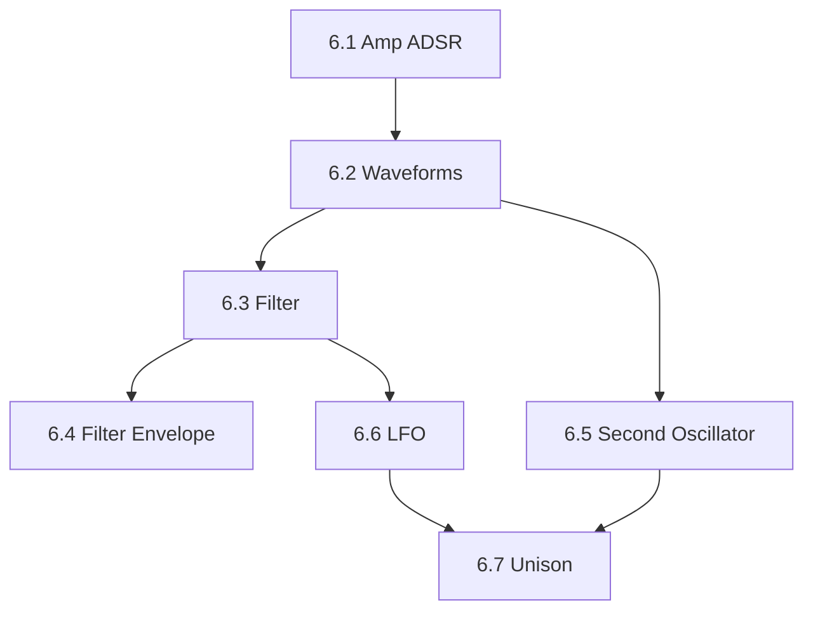

# Phase 6 — DSP Roadmap

The core synthesis engine. Transforms Solace Synth from a sine-wave demo into a real polyphonic subtractive synth.

---

## Architecture Overview

All DSP lives in `Source/DSP/`. Each module is a header-only or `.h/.cpp` pair. Modules are composed **per-voice** inside `SolaceVoice::renderNextBlock()`, while global effects (if any later) go in `PluginProcessor::processBlock()` after `synth.renderNextBlock()`.

```
Signal flow (per voice):
  MIDI note-on → startNote()
       ↓
  Oscillator 1 ──┐
                  ├── Mix ── Filter ── Amp Envelope ── output
  Oscillator 2 ──┘
       ↑                      ↑              ↑
     LFO mod             Filter Env       Velocity
```

### APVTS Parameter Naming Convention

All new parameters follow the pattern: `{section}{ParamName}` with version `1`.

Examples: `ampAttack`, `ampDecay`, `osc1Waveform`, `filterCutoff`, `lfoRate`.

Parameters MUST be registered in `createParameterLayout()` **before** any APVTS snapshot can reference them.

---

## Sub-Phase 6.1 — Amplifier ADSR Envelope

**Why first:** Without an envelope, every note is an organ-like gate (on/off). ADSR is the single biggest improvement to playability and proves the per-voice ADSR pipeline.

### Files

| Action | File | What |
|--------|------|------|
| NEW | `Source/DSP/SolaceADSR.h` | Thin wrapper around `juce::ADSR`. Holds `juce::ADSR::Parameters`. Provides `trigger()`, `release()`, `getNextSample()`, `isActive()`, `setSampleRate()`. Keeps the voice code clean. |
| MODIFY | `Source/DSP/SolaceVoice.h` | Add `SolaceADSR ampEnvelope` member. In `startNote()`: set ADSR params from APVTS + call `ampEnvelope.trigger()`. In `stopNote()`: call `ampEnvelope.release()` if tail-off allowed. In `renderNextBlock()`: multiply each sample by `ampEnvelope.getNextSample()`. Remove the manual `tailOff` exponential decay — ADSR replaces it. Stop voice when `!ampEnvelope.isActive()`. |
| MODIFY | `Source/PluginProcessor.cpp` | Add 4 parameters to `createParameterLayout()`: `ampAttack` (0.001–5.0s, default 0.01), `ampDecay` (0.001–5.0s, default 0.1), `ampSustain` (0.0–1.0, default 0.8), `ampRelease` (0.001–10.0s, default 0.3). |

### APVTS ↔ Voice Sync Design

The voice needs to read APVTS values at note-on time. Two approaches:

- **Option A (simple, recommended for now):** Voice reads APVTS params via a pointer to the processor in `startNote()`. Each note snapshot the envelope params at trigger time.
- **Option B (future):** Smoothed per-sample modulation of ADSR params. Overkill for V1.

> [!IMPORTANT]
> The voice needs a reference to the APVTS to read parameters. Pass a `const std::atomic<float>*` for each ADSR param from the Processor to the Voice at construction time (stored in the voice, read at note-on). This avoids any thread-safety issue — `getRawParameterValue()` returns an atomic.

### Verification

1. Rebuild, launch standalone.
2. Set attack to ~0.5s → note should fade in.
3. Set release to ~2.0s → note should sustain after release.
4. Set sustain to 0.0 → note should decay fully even while held.
5. Check `info.log` for ADSR parameter registration.

---

## Sub-Phase 6.2 — Oscillator Waveforms

**Why second:** After ADSR, the next most impactful feature. Adds timbral variety.

### Waveforms (confirmed: 4 basic, computed not wavetable)

| Waveform | Algorithm |
|----------|-----------|
| Sine | `std::sin(angle)` (current) |
| Sawtooth | `2.0 * (angle / twoPi) - 1.0` (naïve, OK for V1) |
| Square | `angle < pi ? 1.0 : -1.0` (naïve) |
| Triangle | `2.0 * abs(2.0 * (angle / twoPi) - 1.0) - 1.0` |

> [!NOTE]
> Naïve waveforms cause aliasing at high frequencies. This is acceptable for V1. For V2, we can switch to PolyBLEP (band-limited) or wavetable synthesis. The module boundary is clean enough that swapping the oscillator internals doesn't affect anything outside.

### Files

| Action | File | What |
|--------|------|------|
| NEW | `Source/DSP/SolaceOscillator.h` | Oscillator class with `setWaveform(int)`, `setFrequency(double, double sampleRate)`, `getNextSample()`, `reset()`. Internal angle state. Enum: `Sine=0, Saw=1, Square=2, Triangle=3`. |
| MODIFY | `Source/DSP/SolaceVoice.h` | Replace inline `std::sin()` with `SolaceOscillator osc`. In `startNote()`: `osc.setFrequency(...)`. In `renderNextBlock()`: `osc.getNextSample()`. |
| MODIFY | `Source/PluginProcessor.cpp` | Add parameter: `osc1Waveform` (int, 0–3, default 0/Sine). |

### Verification

1. Cycle through waveforms via APVTS UI control.
2. Each should sound distinct: sine=pure, saw=buzzy, square=hollow, triangle=mellow.
3. No crashes, no silence when switching mid-note.

---

## Sub-Phase 6.3 — Filter

**Why third:** Subtractive synthesis is defined by its filter. LP filter + cutoff + resonance is the core sound-shaping tool.

### JUCE filter options (research confirmed):

| Class | Modes | Slope | Modulation-safe | Notes |
|-------|-------|-------|-----------------|-------|
| `juce::dsp::StateVariableTPTFilter` | LP / HP / BP | 12 dB/oct | ✅ Yes (TPT design) | Best for fast cutoff sweeps, no artifacts |
| `juce::dsp::LadderFilter` | LP12 / LP24 / HP12 / HP24 / BP12 / BP24 | Variable | ✅ Yes | Moog-style, richer but heavier CPU |

**Recommendation:** Start with `StateVariableTPTFilter` for LP12. It's lighter weight, designed for modulation, and gives us LP + HP + BP in one class. Add LP24 (LadderFilter mode) later if needed.

### Files

| Action | File | What |
|--------|------|------|
| NEW | `Source/DSP/SolaceFilter.h` | Wrapper around `juce::dsp::StateVariableTPTFilter<float>`. Provides `setCutoff()`, `setResonance()`, `setType()`, `processSample()`, `reset()`, `prepare()`. |
| MODIFY | `Source/DSP/SolaceVoice.h` | Add `SolaceFilter filter` member. Call `filter.prepare()` in voice setup, `filter.processSample()` per sample in `renderNextBlock()` (after oscillator, before amp envelope). |
| MODIFY | `Source/PluginProcessor.cpp` | Add parameters: `filterCutoff` (20–20000 Hz, skew, default 20000), `filterResonance` (0.0–1.0, default 0.0), `filterType` (0=LP, 1=HP, 2=BP, default 0/LP). |

> [!IMPORTANT]
> **Per-voice filter instances.** Each voice needs its own filter state, otherwise polyphonic notes share cutoff state and interfere. This is already natural since `SolaceFilter` is a member of `SolaceVoice`.

### Verification

1. Play notes → sweep cutoff from 20kHz down to 200Hz. Sound should get duller.
2. Increase resonance → filter should self-oscillate at high Q.
3. Switch to HP → bass should disappear.
4. Multiple simultaneous notes should filter independently.

---

## Sub-Phase 6.4 — Filter Envelope (ADSR)

**Why fourth:** The filter envelope makes the filter dynamic. A pluck sound = filter envelope with fast attack, medium decay, low sustain.

### Files

| Action | File | What |
|--------|------|------|
| MODIFY | `Source/DSP/SolaceVoice.h` | Add second `SolaceADSR filterEnvelope`. In `renderNextBlock()`: modulate filter cutoff per-sample using `filterEnvelope.getNextSample() * filterEnvDepth`. |
| MODIFY | `Source/PluginProcessor.cpp` | Add parameters: `filterEnvAttack`, `filterEnvDecay`, `filterEnvSustain`, `filterEnvRelease`, `filterEnvDepth` (bipolar -1.0 to 1.0, controls how much envelope modulates cutoff). |

### Verification

1. Set filter cutoff to ~1kHz, env depth to +1.0, fast attack, medium decay → classic pluck.
2. Set env depth to -1.0 → inverted sweep (high → low).
3. Depth at 0.0 → no envelope effect, filter stays static.

---

## Sub-Phase 6.5 — Second Oscillator

**Why fifth:** The vision doc requires "at least two oscillators."

### Files

| Action | File | What |
|--------|------|------|
| MODIFY | `Source/DSP/SolaceVoice.h` | Add `SolaceOscillator osc2`. Mix `osc1` and `osc2` per-sample before filter. |
| MODIFY | `Source/PluginProcessor.cpp` | Add parameters: `osc2Waveform` (0–3), `osc2Octave` (-3 to +3 semitones, int), `osc2Detune` (-100 to +100 cents, float), `oscMix` (0.0–1.0, 0.0=osc1 only, 1.0=osc2 only, 0.5=equal). |

### Verification

1. Set osc1=Saw, osc2=Square, mix=0.5 → classic thick pad sound.
2. Detune osc2 by ~10 cents → should hear chorus/beating effect.
3. Octave shift osc2 up → fifth-like harmony.
4. Mix=0.0 → only osc1 audible. Mix=1.0 → only osc2 audible.

---

## Sub-Phase 6.6 — LFO

**Why sixth:** Adds movement and life. LFO modulates filter cutoff, pitch, or amplitude.

### Files

| Action | File | What |
|--------|------|------|
| NEW | `Source/DSP/SolaceLFO.h` | Free-running oscillator (not note-triggered). Sine, Triangle, Saw, Square, S&H shapes. `getNextSample()` returns -1.0 to 1.0 at the LFO rate. |
| MODIFY | `Source/DSP/SolaceVoice.h` | Add `SolaceLFO lfo`. Apply `lfo.getNextSample() * lfoDepth` to the selected target in `renderNextBlock()`. |
| MODIFY | `Source/PluginProcessor.cpp` | Add parameters: `lfoRate` (0.01–50 Hz), `lfoShape` (0–4), `lfoTarget` (0=FilterCutoff, 1=Pitch, 2=Amp), `lfoDepth` (0.0–1.0). |

> [!NOTE]
> **Spec gap:** The full modulation target list hasn't been decided yet. Start with filter cutoff / pitch / amp — enough to prove the routing works. Can expand targets later without architectural changes.

### Verification

1. LFO → filter cutoff with slow rate → classic wah effect.
2. LFO → pitch with small depth → vibrato.
3. LFO → amp → tremolo.
4. Switch shapes mid-playback → no clicks or crashes.

---

## Sub-Phase 6.7 — Unison

**Why last in the core DSP:** Complex. Requires running N copies of the oscillators per voice with detuning + stereo spread. Most CPU-intensive feature.

### Files

| Action | File | What |
|--------|------|------|
| MODIFY | `Source/DSP/SolaceVoice.h` | Instead of 1 osc per slot, support up to N unison copies (configurable). Each copy detuned by `unisonDetune * spreadFactor`. Pan each copy across stereo field. Sum all copies. |
| MODIFY | `Source/PluginProcessor.cpp` | Add parameters: `unisonCount` (1-8, default 1), `unisonDetune` (0–100 cents), `unisonSpread` (0.0–1.0 stereo width). |

### Verification

1. Unison count=1 → same as before (no change).
2. Unison count=4, detune=20 cents → thick supersaw.
3. Stereo spread → wide stereo image on headphones.
4. CPU usage check — 8 unison × 8 voices = 64 oscillators per block. Should still be real-time.

---

## Branching Strategy

> [!IMPORTANT]
> **Recommendation: single `main` branch for now.**
>
> You're a solo developer (with AI assistance). Feature branches add merge overhead and context-switching cost that isn't justified yet. Each sub-phase is small enough (1-2 sessions) that a feature branch would barely live long enough to matter.
>
> **When to switch to branches:** When your friend starts contributing code, or if a sub-phase gets complex enough that you want to experiment without risking `main`. At that point, use short-lived feature branches (`feature/filter`, `feature/lfo`) that merge back within 1-2 days.
>
> **One rule:** Always build before committing. `cmake --build build --config Release` must succeed.

---

## Parameter Summary (all new APVTS params)

| Sub-Phase | Parameter ID | Type | Range | Default |
|-----------|-------------|------|-------|---------|
| 6.1 | `ampAttack` | float | 0.001–5.0 s | 0.01 |
| 6.1 | `ampDecay` | float | 0.001–5.0 s | 0.1 |
| 6.1 | `ampSustain` | float | 0.0–1.0 | 0.8 |
| 6.1 | `ampRelease` | float | 0.001–10.0 s | 0.3 |
| 6.2 | `osc1Waveform` | int | 0–3 | 0 (Sine) |
| 6.3 | `filterCutoff` | float | 20–20000 Hz | 20000 |
| 6.3 | `filterResonance` | float | 0.0–1.0 | 0.0 |
| 6.3 | `filterType` | int | 0–2 | 0 (LP) |
| 6.4 | `filterEnvAttack` | float | 0.001–5.0 s | 0.01 |
| 6.4 | `filterEnvDecay` | float | 0.001–5.0 s | 0.3 |
| 6.4 | `filterEnvSustain` | float | 0.0–1.0 | 0.0 |
| 6.4 | `filterEnvRelease` | float | 0.001–10.0 s | 0.3 |
| 6.4 | `filterEnvDepth` | float | -1.0–1.0 | 0.0 |
| 6.5 | `osc2Waveform` | int | 0–3 | 1 (Saw) |
| 6.5 | `osc2Octave` | int | -3–+3 | 0 |
| 6.5 | `osc2Detune` | float | -100–+100 cents | 0.0 |
| 6.5 | `oscMix` | float | 0.0–1.0 | 0.5 |
| 6.6 | `lfoRate` | float | 0.01–50 Hz | 1.0 |
| 6.6 | `lfoShape` | int | 0–4 | 0 (Sine) |
| 6.6 | `lfoTarget` | int | 0–2 | 0 (FilterCutoff) |
| 6.6 | `lfoDepth` | float | 0.0–1.0 | 0.0 |
| 6.7 | `unisonCount` | int | 1–8 | 1 |
| 6.7 | `unisonDetune` | float | 0–100 cents | 0.0 |
| 6.7 | `unisonSpread` | float | 0.0–1.0 | 0.5 |

---

## Dependency Order (cannot reorder)



- 6.1 → 6.2 → 6.3 → 6.4 is the critical path.
- 6.5 (second osc) can start after 6.2 — independent of filter work.
- 6.6 (LFO) needs a filter to modulate, so depends on 6.3.
- 6.7 (unison) is last — needs oscillators and benefits from filter.

---

## Nice-To-Have (V1.1 / V2 — not blocking release)

- [ ] PolyBLEP anti-aliased waveforms (replaces naïve math)
- [ ] Portamento / glide
- [ ] Preset system (save/load APVTS state as JSON)
- [ ] Voice count configuration (reduce polyphony to save CPU)
- [ ] Global effects chain (reverb, delay, chorus)
- [ ] Pitch wheel / mod wheel support (requires `pitchWheelMoved` override)
