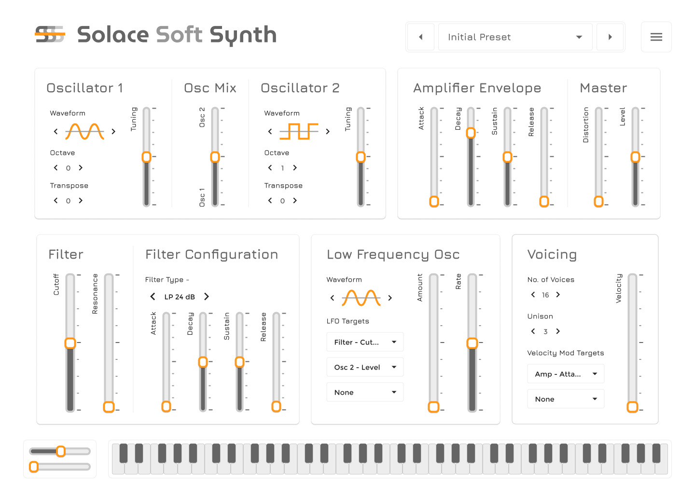

# Solace - A Substractive Soft Synth

A free, open-source polyphonic soft synthesizer — available as a **VST3 plugin** and **standalone application**.

Built from scratch in C++ with [JUCE 8](https://juce.com/), featuring a modern WebView-based UI designed in Figma and implemented in HTML/CSS/JS.

<p align="center">
  
  <br>
  <em>Figma UI Design</em>
</p>

## 📥 Installation

Currently, Solace Synth is available for **Windows** (VST3 and Standalone).

1. Go to the [Releases](../../releases) page and download the latest `Solace-Synth-Win.zip`.
2. Extract the contents:
   - **VST3 Plugin:** Copy the `Solace Synth.vst3` folder into your system VST3 directory (typically `C:\Program Files\Common Files\VST3\`).
   - **Standalone App:** Simply run `Solace Synth.exe` to play the synth without a DAW.
3. *Note: Solace uses a modern web-based UI. It requires the [Microsoft Edge WebView2 Runtime](https://developer.microsoft.com/en-us/microsoft-edge/webview2/) (which is already installed by default on Windows 11).*

## 🎹 Quick Start

- **Presets:** Click the preset dropdown at the top to explore the included **Factory Presets**, or click "Save" to create your own patches. User presets are safely stored in `Documents/Solace Synth/Presets/User/`.
- **Resizable UI:** Grab the bottom-right corner of the plugin window to freely scale the interface to perfectly fit your monitor.
- **On-Screen Keyboard:** Use your mouse or your computer keyboard (A/S/D/F) to play notes directly if you don't have a MIDI controller connected.


## Features

### Oscillators
- **Dual oscillators** — Sine, Sawtooth, Square, Triangle waveforms
- Per-oscillator octave, transpose, and fine-tuning controls
- Adjustable oscillator mix (level blend between Osc 1 and Osc 2)

### Filter
- Classic Ladder filter with **LP12, LP24, and HP12** modes
- Cutoff (20 Hz – 20 kHz), resonance, and dedicated filter ADSR envelope
- Filter envelope depth control with bipolar sweep direction

### Envelopes & Modulation
- **Amplifier ADSR** envelope with master level control
- **Filter ADSR** envelope with configurable depth
- **LFO** — Sine, Triangle, Sawtooth, Square, and Sample & Hold waveforms (0.01–50 Hz) with 3 assignable modulation targets
- **Velocity modulation** — 3 routing slots assignable to Amp Level, Amp Attack, Filter Cutoff, Filter Resonance, Distortion, Oscillator Pitch, or Oscillator Mix

### Polyphony & Unison
- **Polyphony** — 1–16 configurable voices with voice stealing
- **Unison** — 1–8 voices per note with detune (0–100 cents) and stereo spread

### Performance
- **Pitch bend** and **mod wheel (CC#1)** support
- Distortion module (warm `tanh` soft-clipping with transparent passthrough)
- On-screen MIDI keyboard with computer keyboard mapping

### UI
- Modern slider-based interface built with JUCE 8's native WebView integration (WebView2 on Windows)
- Fully resizable window scaling dynamically with CSS `clamp()`
- Comprehensive preset system with `.solace` XML files and factory/user banks
- Designed in Figma and implemented in vanilla HTML/CSS/JS
- Real-time bidirectional parameter bridge between C++ audio engine and JS frontend

---

## 🛠️ For Developers

## Tech Stack

| Component | Technology |
|---|---|
| Audio Engine | C++ (C++20) with JUCE 8.0.4 |
| UI Frontend | HTML / CSS / JavaScript (WebView) |
| Build System | CMake 3.25+ |
| Output Formats | VST3 plugin, Standalone application |

## Building

### Prerequisites

- **Windows:** Visual Studio 2022/2026 or later with "Desktop development with C++" workload
- CMake 3.25+
- Git

### Build Steps

```bash
# Configure (first time — downloads JUCE automatically via FetchContent)
cmake -B build

# Build
cmake --build build --config Release
```

The built plugin and standalone app will be in `build/SolaceSynth_artefacts/Release/`.

- **VST3:** `VST3/Solace Synth.vst3` — copy to your system VST3 folder
- **Standalone:** `Standalone/Solace Synth.exe` — portable, runs directly (requires WebView2 runtime on Windows)

### Development Build

Debug builds serve UI files from disk for rapid iteration (`SOLACE_ENABLE_DEV_UI_FALLBACK=1`). Release builds embed all UI assets as binary data.

## Project Structure

```
Source/                  C++ audio engine and plugin code
  ├── PluginProcessor    JUCE AudioProcessor + parameter tree (APVTS)
  ├── PluginEditor       WebView host + C++↔JS bridge
  ├── SolacePresetManager Preset serialization and file management
  ├── SolaceLogger       Debug logging utility
  └── DSP/               Audio DSP modules
      ├── SolaceVoice        Per-voice synthesis engine
      ├── SolaceOscillator   Waveform generator (phase accumulation)
      ├── SolaceFilter       Ladder filter (LP/HP)
      ├── SolaceADSR         Envelope generator
      ├── SolaceLFO          Low-frequency oscillator
      ├── SolaceDistortion   Waveshaper (tanh soft-clipping)
      └── SolaceSound        JUCE SynthesiserSound stub

UI/                      WebView frontend (HTML/CSS/JS)
  ├── index.html         DOM structure and mount points
  ├── styles.css         Hand-written styling (no framework)
  ├── main.js            Application orchestrator
  ├── bridge.js          C++↔JS bidirectional bridge
  └── components/        Reusable UI controls
      ├── fader.js           Horizontal slider with fine-tuning
      ├── dropdown.js        Dropdown selector (filter type, LFO targets, etc.)
      ├── waveform-selector  Waveform picker with icon labels
      └── arrow-selector     Number spinner (+/– buttons)
```

## Architecture

The audio engine runs entirely in C++, with every DSP module written from scratch — no third-party DSP libraries. The synthesis pipeline follows a standard subtractive architecture:

```
Oscillator 1 ─┐
               ├─ Mix ─→ Filter ─→ Distortion ─→ Amp Envelope ─→ Output
Oscillator 2 ─┘           ↑              ↑
                     Filter Env      Velocity Mod
                           ↑
                          LFO (assignable targets)
```

All parameters are managed through JUCE's `AudioProcessorValueTreeState` (APVTS) — the single source of truth. Voices snapshot parameter values at note-on via atomic reads, ensuring zero allocations and zero locks on the audio thread.

The UI communicates with the C++ backend through JUCE's native WebView relay bridge. Parameter changes flow bidirectionally: user interactions in JS call `setParameter()` on the C++ side, while automation and preset changes in C++ push updates back to JS via `parameterChanged()` callbacks.

## License

This project is licensed under the **GNU Affero General Public License v3.0** — see the [LICENSE](LICENSE) file for details.

JUCE is used under its own license terms. See [juce.com/legal](https://juce.com/legal/juce-8-licence/) for details.

## Authors

- **Anshul** — Audio engine, DSP, C++ backend, project architecture
- **Nabeel** — UI/UX design (Figma), frontend implementation
